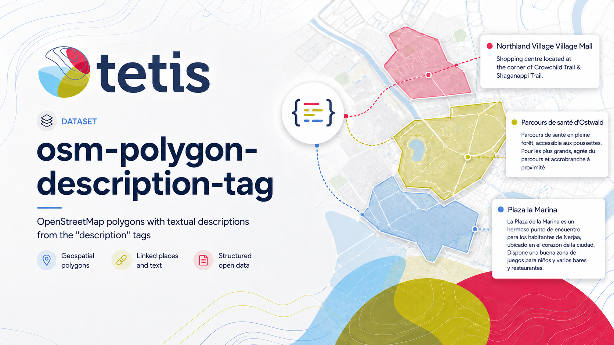

# OSM Polygon Description Tag

Reproducible OpenStreetMap polygon extraction with complete tags, full
GeoParquet geometry, geodesic area, and resumable Hugging Face publication.

The public documentation site is built with MkDocs Material:

```bash
uv run mkdocs serve
```

It is published automatically from `main` with GitHub Pages at
[noeflandre.github.io/osm-polygon-description-tag](https://noeflandre.github.io/osm-polygon-description-tag/).
The deployment workflow builds the strict site from the locked uv environment.

Read the documentation:

- [Getting started](docs/getting-started.md)
- [Dataset contract](docs/dataset-contract.md)
- [Operations](docs/operations.md)
- [CLI reference](docs/cli.md)
- [Development](docs/development.md)
- [Architecture](docs/architecture.md)

## Quick start

```bash
cd /Users/noeflandre/osm-polygon-description-tag
uv sync --locked
just run-and-publish
```

The workflow is stoppable with Ctrl-C and resumable by rerunning the same
command after the terminal prompt returns.

## Boundaries

- Code: `/Users/noeflandre/osm-polygon-description-tag`
- Immutable raw PBFs: `/Volumes/Seagate M3/projects/osm-polygon-wikidata-only/raw`
- Generated data: `/Volumes/Seagate M3/projects/osm-polygon-description-tag`
- Hugging Face dataset: `NoeFlandre/osm-polygon-description-tag`

The raw source is read-only. Tests, documentation builds, and CI do not access
the real PBF corpus or publish to Hugging Face.

Project code is Apache-2.0. Derived OpenStreetMap data is © OpenStreetMap
contributors and subject to the Open Database License (ODbL).
