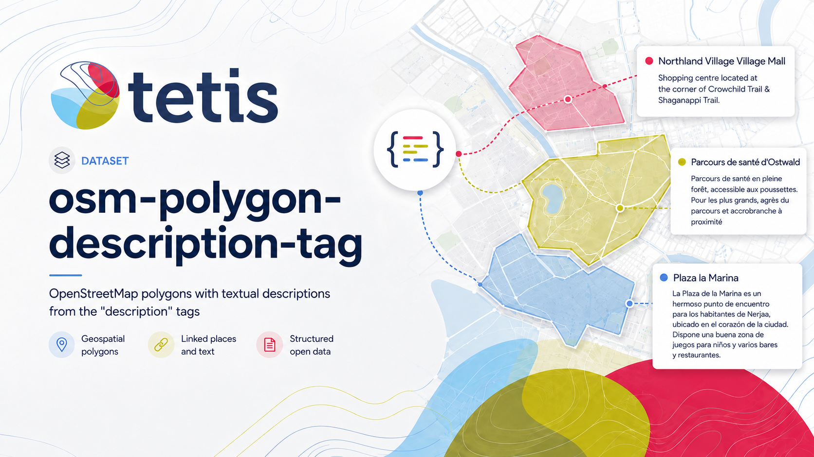

# OSM Polygon Description Tag

Reproducible OpenStreetMap polygon extraction with complete tags, full
GeoParquet geometry, geodesic area, and resumable Hugging Face publication.

It reads OpenStreetMap `.osm.pbf` extracts, keeps every polygon that carries a
`description` tag, and writes one validated GeoParquet file per extract with
all tags, the full geometry and its geodesic area. The maintainer publishes
the result as the Hugging Face dataset
[`NoeFlandre/osm-polygon-description-tag`](https://huggingface.co/datasets/NoeFlandre/osm-polygon-description-tag).

## Prerequisites

- Python 3.12 via [uv](https://docs.astral.sh/uv/)
- [`osmium-tool`](https://osmcode.org/osmium-tool/) (`brew install osmium-tool`, or `apt install osmium-tool`)
- [`just`](https://just.systems/) for the recipes (optional)
- For publishing only: the Hugging Face `hf` CLI, logged in with write access

## Install

```bash
git clone https://github.com/NoeFlandre/osm-polygon-description-tag
cd osm-polygon-description-tag
uv sync --locked
```

## Usage

Put one or more PBFs, for example a small country from
[Geofabrik](https://download.geofabrik.de/), in a directory of their own, and
pick a separate, empty directory for the output:

```bash
export OSM_POLYGON_SOURCE_ROOT=/path/to/pbfs
export OSM_POLYGON_DATA_ROOT=/path/to/data-root

uv run osm-polygon-description-tag inspect        # read-only: list what would be built
uv run osm-polygon-description-tag build-all      # build every extract
uv run osm-polygon-description-tag validate       # check the outputs
uv run osm-polygon-description-tag generate-card  # write stats.json and README.md
uv run osm-polygon-description-tag publish-plan   # dry run: print the upload plan
```

None of these upload anything. `just run-and-publish` builds and publishes in
one resumable command, but only to the maintainer's dataset: it needs write
access to it. The workflow is stoppable with Ctrl-C and resumable by rerunning
the same command.

## Outputs

Under the data root:

```text
data/<extract>.parquet            GeoParquet, one row per polygon
manifests/<extract>.manifest.json build manifest for that file
stats.json, README.md             dataset statistics and card
logs/                             redacted JSONL event log
```

The column schema and guarantees are in the [dataset contract](docs/dataset-contract.md).

## Configuration

| Setting | CLI option | Environment variable |
| --- | --- | --- |
| Immutable PBF directory | `--source-root` | `OSM_POLYGON_SOURCE_ROOT` |
| Generated-data directory | `--data-root` | `OSM_POLYGON_DATA_ROOT` |
| osmium binary | `--osmium` | none |

The source root is never written to, and the two roots must not contain each
other. Commands that only read generated data need only the data root.

## Docker

A non-root image ships the locked environment and `osmium-tool`:

```bash
just docker-build
just docker-help
just docker-run /path/to/data-root   # PBFs are read from /path/to/data-root/raw
```

The data root keeps checkpoints, so rerunning resumes safely. `HF_TOKEN` is
passed only at runtime and never copied into the image. See the
[Docker guide](docs/development.md#docker-reproducibility).

## Documentation

The documentation site is built with MkDocs Material (`uv run mkdocs serve`)
and published from `main` at
[noeflandre.github.io/osm-polygon-description-tag](https://noeflandre.github.io/osm-polygon-description-tag/).
There is also a [codebase presentation](https://noeflandre.github.io/osm-polygon-description-tag/slides/codebase/codebase.html).

- [Getting started](docs/getting-started.md)
- [Dataset contract](docs/dataset-contract.md)
- [Operations](docs/operations.md)
- [CLI reference](docs/cli.md)
- [Development](docs/development.md)
- [Architecture](docs/architecture.md)
- [Contributing](CONTRIBUTING.md) and [security policy](SECURITY.md)

Tests, documentation builds, and CI never read a real PBF corpus or publish to
Hugging Face.

## License

Project code is Apache-2.0. Derived OpenStreetMap data is © OpenStreetMap
contributors and subject to the Open Database License (ODbL).

## Citation

If you use this software or its dataset, please cite the repository using the
metadata in [`CITATION.cff`](CITATION.cff). GitHub uses this file to provide
formatted citation downloads through **Cite this repository**.
