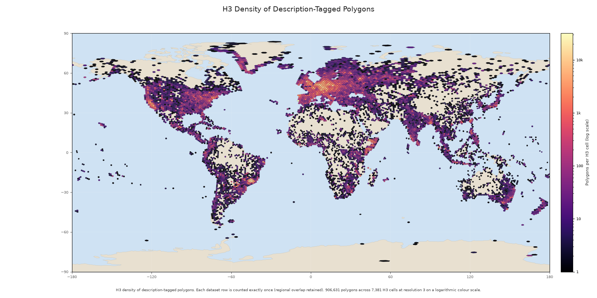
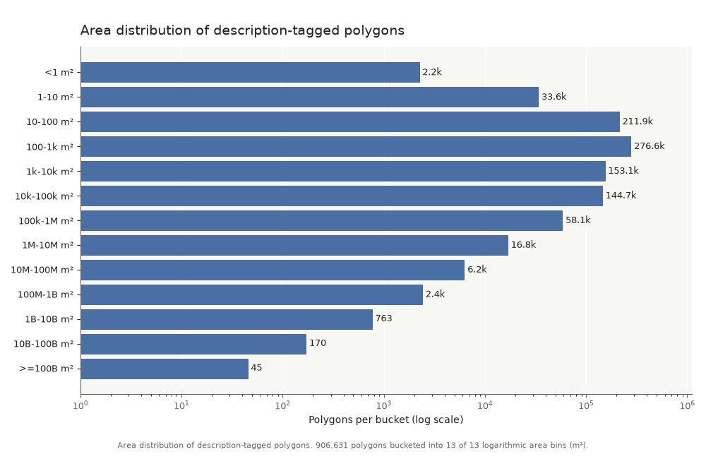

<!-- padding: roomy -->

Dataset briefing · snapshot 2026-08

# A global atlas of described OSM polygons

906,631 deduplicated polygon rows, each carrying the source tags, geometry,
area, provenance, and exact description text that made it discoverable.

Open dataset · GeoParquet 1.1 · ODbL-derived OpenStreetMap data

Sources: generated stats.json; docs/dataset-contract.md; dataset card snapshot

---

<!-- padding: compact -->
<!-- class: balanced -->

## The inclusion rule is simple and deliberately narrow

Keep a feature when it is a polygon and at least one exact description tag is
non-empty.

<!-- columns: 2 -->

**Included**

- Tagged closed ways that OSM classifies as areas
- `type=multipolygon` and `type=boundary` relations that assemble
- `description=*` or `description:<suffix>=*`
- `area=yes` remains authoritative

|||

**Excluded**

- Nodes and open ways
- `area=no`
- Empty or whitespace-only descriptions
- Failed relation assemblies and non-polygon output

Sources: docs/dataset-contract.md; config/osmium-export.json; generated stats.json

---

<!-- padding: compact -->
<!-- class: balanced -->

## The snapshot is large in input, selective in output

<!-- columns: 3 -->

83.0 GB

source PBF bytes

|||

869.9M

emitted OSM features

|||

906.6k

published rows

386 regional PBF extracts become 386 Parquet files totaling 712.4 MiB. The
final rows are unique by `(osm_type, osm_id)`; 38,851 duplicate candidates were
removed during global deduplication.

Source: generated stats.json; values rounded for presentation, exact values remain in stats.json

---

<!-- layout: section-break -->

## Read each row as a small, queryable OSM record

The dataset keeps both the source authority and analysis-ready projections.

---

<!-- padding: compact -->
<!-- class: balanced -->

## Every row keeps the evidence behind the label

<!-- columns: 2 -->

**Text and provenance**

- Base and localized names
- Base and localized descriptions
- Complete original `tags` map
- OSM version, changeset, timestamp, source PBF, and URL

|||

**Geometry and measurement**

- Full Polygon or MultiPolygon WKB
- OGC:CRS84 longitude/latitude semantics
- WGS84 geodesic `area_m2`
- Bounding box covering the complete geometry

The convenience columns are exact derived views;
`tags` is the authoritative source map.

Sources: docs/dataset-contract.md; generated stats.json

---

<!-- padding: compact -->
<!-- class: balanced -->

## Descriptions are predominantly base text, with a multilingual tail

<!-- columns: 2 -->

**Base descriptions**

887,077

values · 5.11M words · median 4 words

|||

**Localized descriptions**

32,049

values · 214k words · median 3 words

The most common exact localized suffixes are `de`, `en`, `it`, `fr`, and `ru`.
Suffixes are preserved verbatim; they are not asserted to be valid language
codes.

Source: generated stats.json; suffix interpretation from docs/dataset-contract.md

---

<!-- padding: compact -->
<!-- class: plot-slide -->

## The global distribution is dense but uneven

7,381 H3 resolution-3 cells contain rows; log scale keeps sparse and dense regions visible.

Source: assets/description_polygon_density.png; docs/dataset-contract.md; generated stats.json

---

<!-- padding: compact -->
<!-- class: plot-slide -->

## Most polygons are small, but the tail reaches country scale

Median area: **501 m²** · middle 50%: **85–10,391 m²** · range:
**0.000062–3.48×10¹² m²**.

Source: assets/area_distribution.png; generated stats.json; area_m2 is WGS84 geodesic area

---

<!-- padding: compact -->
<!-- class: balanced -->

## The timestamps span the history of modern OSM mapping

<!-- columns: 2 -->

2007 → 2026

minimum to maximum OSM object timestamp (UTC)

|||

The timestamp is object provenance, not a dataset publication date. Text and
geometry reflect the source extracts at their recorded OSM timestamps.

Source: generated stats.json; docs/dataset-contract.md

---

<!-- padding: compact -->
<!-- class: balanced -->

## Interpretation needs three guardrails

**Language** — localized suffixes are exact OSM keys, not validated language
codes.

**Text quality** — descriptions are community-authored and vary in language,
formatting, completeness, and quality.

**Spatial meaning** — the H3 map counts polygon centroids and the extracts are
regional snapshots; the dataset is not a population or land-cover estimate.

Sources: dataset-card-template.md; docs/dataset-contract.md

---

<!-- padding: roomy -->

Access and reuse

# Explore the rows, then reproduce the snapshot

Dataset: [huggingface.co/datasets/NoeFlandre/osm-polygon-description-tag](https://huggingface.co/datasets/NoeFlandre/osm-polygon-description-tag)

Metrics: [Trackio snapshot dashboard](https://noeflandre-osm-polygon-description-tag-trackio.static.hf.space/?project=osm-polygon-description-tag&sidebar=hidden)

Source and methodology: [github.com/NoeFlandre/osm-polygon-description-tag](https://github.com/NoeFlandre/osm-polygon-description-tag)

Derived data is © OpenStreetMap contributors and available under ODbL.

Sources: generated README.md; docs/index.md; docs/dataset-contract.md

